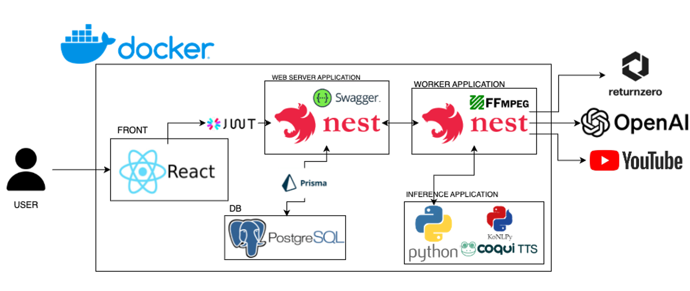
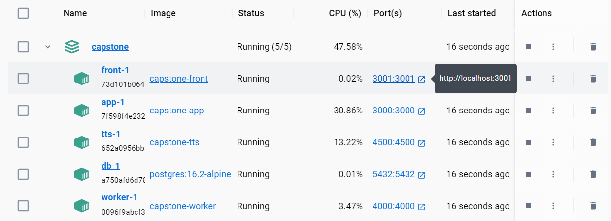
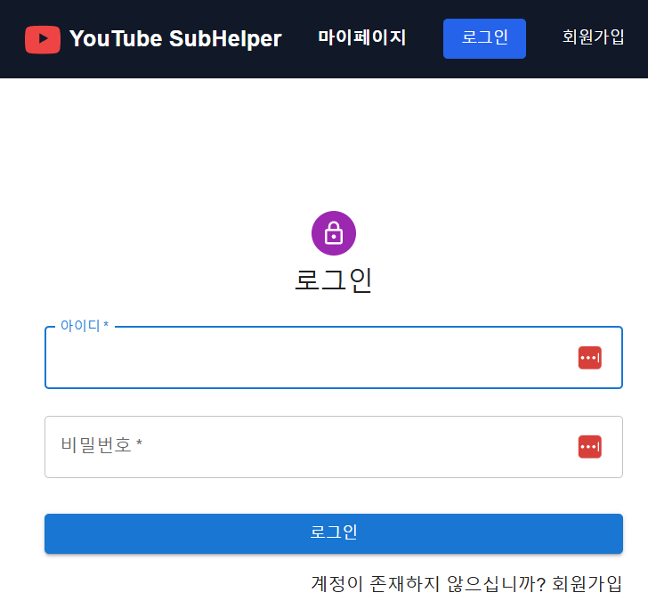
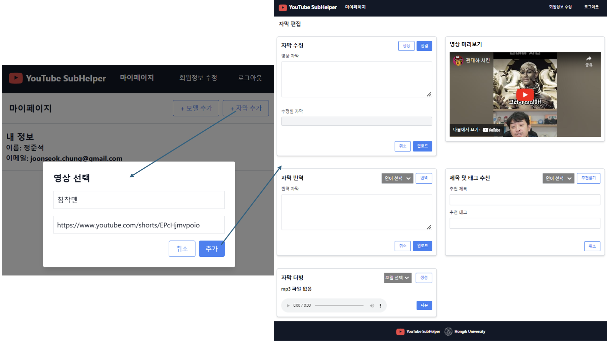
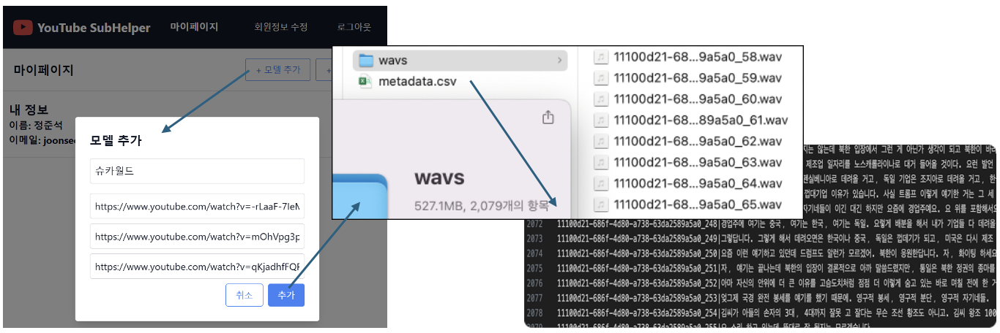

# Youtube Subhelper

Youtube Subhelper is a program that creates multilingual subtitles and voice-cloned dubbing using only a YouTube link.

It streamlines the process of creating subtitles and dubbing by automating speech recognition, translation, and text-to-speech synthesis. Additionally, the program can generate LJSpeech datasets from multiple YouTube links for further training or research purposes.

- [Contributers](#Contributers)
- [Features](#Features)
- [Diagram](#Diagram)
- [Prerequisite](#Prerequisite)
- [Installation](#Installation)
- [Usage](#Usage)

## Contributers

- [정준석](https://github.com/chungJS) - joonseok.chung@gmail.com : Leader, Backend
- [이재용](https://github.com/ljy-27) - tomasjy@gmail.com : Backend
- [최원석](https://github.com/dnjstjr0930) - dnjstjr0930@gmail.com : Frontend
- [김범서](https://github.com/bumseokim) - toraonine9@gmail.com : Frontend

## Features

- Generate Korean Subtitles from Youtube link
- Spell check
- Multilingual Translated SRT file
- Recommend title and keywords
- LJSpeech dataset generation using multiple Youtube links
- Full Dubbing audio file using trained model

## Diagram



## Prerequisite

1. [Returnzero api](https://developers.rtzr.ai/)
2. [openAI api](https://platform.openai.com/docs/overview)
3. youtube link

## Installation

```sh
docker compose up -d
```

## Usage

1. connect to localhost:3001



2. login



3. Goto Mypage and select a feature


4. generate Subtitle, recommendation and Dubbing



5. generate LJSpeech dataset


